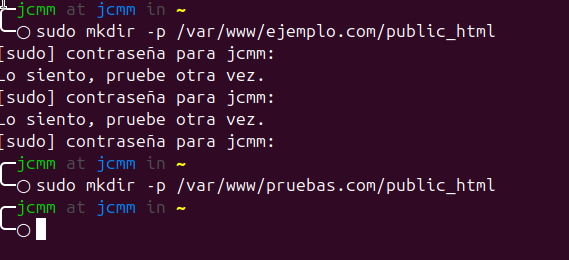
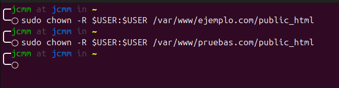
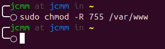
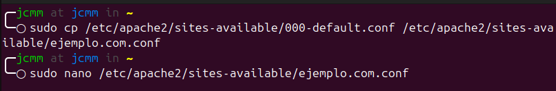
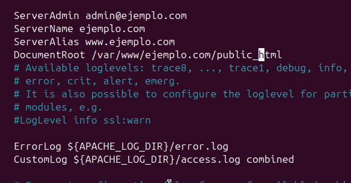
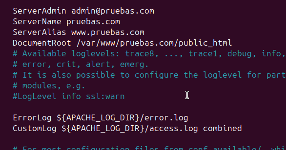
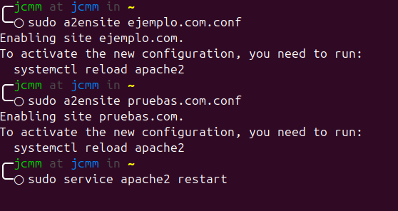

# VirtualHost

## Paso 1 - Crear la Estructura del Directorio

Vamos a crear la estructura del sitio, creando dos directorios para alojar la información del sitio y sus archivos:

## Paso 2 - Otorgar permisos

Para poder modificar los archivos en nuestro directorio web, necesitamos cambiar el propietario haciendo lo siguiente:

Aparte, vamos a modificar ciertos permisos de lectura:

## 3.- Crear una Página de Prueba para cada Virtual Host

Vamos a copiar el archivo de configuración de configuración por defecto para ejemplo.com, y una vez copiado lo editamos:

Una vez copiado, vamos a editarlo: 

Ahora hacemos lo mismo para el segundo dominio. Copiamos este archivo que acabamos de crear y lo editamos para que funcione con 'pruebas.com':

## 5.- Habilita los nuevos Archivos Virtual Host

Vamos a usar a2ensite para habilitarlos

Modificamos el archivo /etc/hosts:

Y comprobamos ambos dominios:

